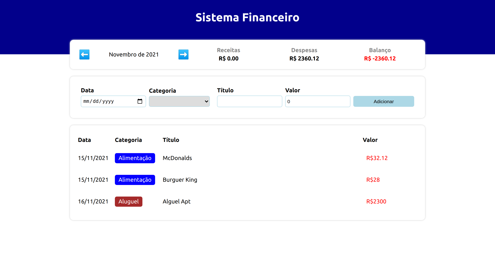

# Expense-tracker

## Controle Financeiro com ReactJS

Esse projeto foi desenvolvido visando revisar e aplicar conceitos aprendidos de ReactJS, com o auxílio dos conhecimentos do Bonieky Lacerda.

Você pode conferir o resultado [clicando aqui!](https://dedecanton.github.io/expense-tracker/)

- Conhecimentos aprimorados
    - HTML
    - CSS
    - Typescript
    - ReactJS
    - Git

- Imagem

